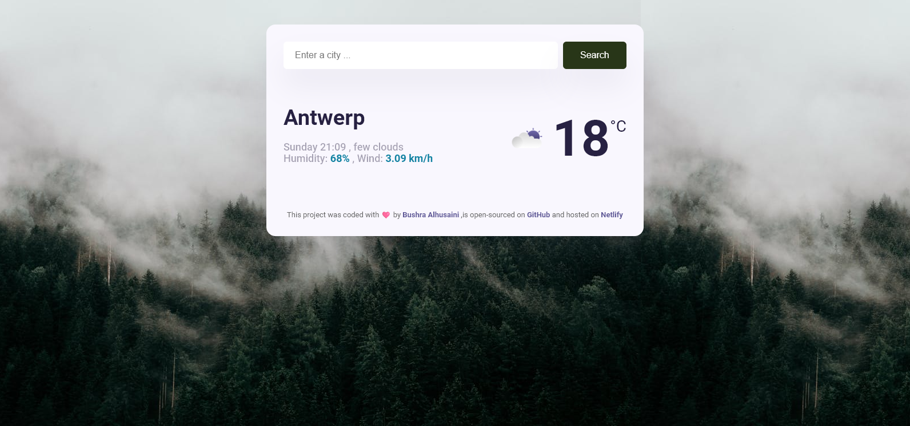

# SkyCast Weather App

> SkyCast is a simple and elegant weather application that allows users to check the current weather conditions for any city. Utilizing the SheCodes weather API, SkyCast provides real-time weather updates, including temperature, humidity, wind speed, and more.
> The application is designed to be user-friendly, with a clean and intuitive interface that makes it easy

## Features

- **Current Weather**: Get updated weather information for any city.
- **Detailed Display**: Clear representation of temperature, humidity, wind speed, and weather conditions.
- **Beautiful Icons**: Visual representation of current weather conditions using icons.
- **Real-time Updates**: Update weather information with a simple search.

## Technologies Used

- **HTML/CSS**: For building the structure and styling of the web application.
- **JavaScript**: For handling dynamic interactions and fetching data.
- **Axios**: To make HTTP requests to the SheCodes weather API.
- **SheCodes Weather API**: Provides the weather data for the application.

## Usage

1. Type the name of a city in the search bar.
2. Press "Enter" or click the submit button to fetch the weather details.
3. View the current weather conditions displayed on the screen.

### Access Online

You can also access the SkyCast Weather App online through this [Netlify link](https://skycast-application.netlify.app/).

## Screenshot

  
_Screenshot of the city search feature._

> Thank you for visiting my profile 😊

